[](https://dev.azure.com/PieroCastillo/AuraUI/_build/latest)
[](https://gitter.im/AuraDevCommunity/Aura-UI)
[](https://www.nuget.org/packages/Aura.UI/)
[](https://www.myget.org/feed/auraui/package/nuget/Aura.UI)
[](https://www.nuget.org/packages/Aura.UI) 
[](http://makeapullrequest.com) 


<h1 align="center">
 
<br/><br/> 
Aura.UI
</h1>


<h2 align="center">Control's Library for Avalonia</h2>

# Overview

| Available Controls |  | 
| -----------------  | --- | 
| FloatingButtonBar | ModernSlider |
| ProgressRing | GroupBox |
| CardCollection | AuraTabView |
| NavigationView | Ribbon |
| ContentDialog | MessageDialog |
| BlurryImage | Badge |
| RadialSlider

# Install

<h2>First Step</h2>

Go to the next link: https://www.nuget.org/packages/Aura.UI .

<h2>Second Step</h2>

Install Aura.UI with Visual Studio or dotnetCLI:

<h3>Visual Studio</h3>

Open the Nuget Packages Manager on your project and search 
Aura.UI.

</img>

<h3>Dotnet CLI</h3>

Open the terminal on the root folder of your project and write <br/>
```cmd
dotnet add package Aura.UI --version 0.1.4.2
```

And don't forget install the Styles
```cmd
dotnet add package Aura.UI.FluentTheme --version 0.1.4.2
```


# Preparation

For Fluent Theme add these Styles to App.xaml

```xml
<Application xmlns="https://github.com/avaloniaui"
             xmlns:x="http://schemas.microsoft.com/winfx/2006/xaml"
             x:Class="YourApp.App">
   <Application.Styles>
      <FluentTheme Mode="Light"/>
      <StyleInclude Source="avares://Aura.UI.FluentTheme/AuraUI.xaml"/>
   </Application.Styles> 
</Application>
```

And for Default Theme add these Styles to App.xaml

```xml
<Application  xmlns="https://github.com/avaloniaui"
              xmlns:x="http://schemas.microsoft.com/winfx/2006/xaml"
              x:Class="YourApp.App">
   <Application.Styles>
      <StyleInclude Source="avares://Avalonia.Themes.Fluent/Accents/BaseLight.xaml"/>
      <StyleInclude Source="avares://Aura.UI.FluentTheme/AuraUI.xaml"/>
      <StyleInclude Source="avares://Avalonia.Themes.Default/Accents/BaseLight.xaml"/>
      <StyleInclude Source="avares://Avalonia.Themes.Default/DefaultTheme.xaml"/>
   </Application.Styles> 
</Application>
```

# Gallery

## Sample
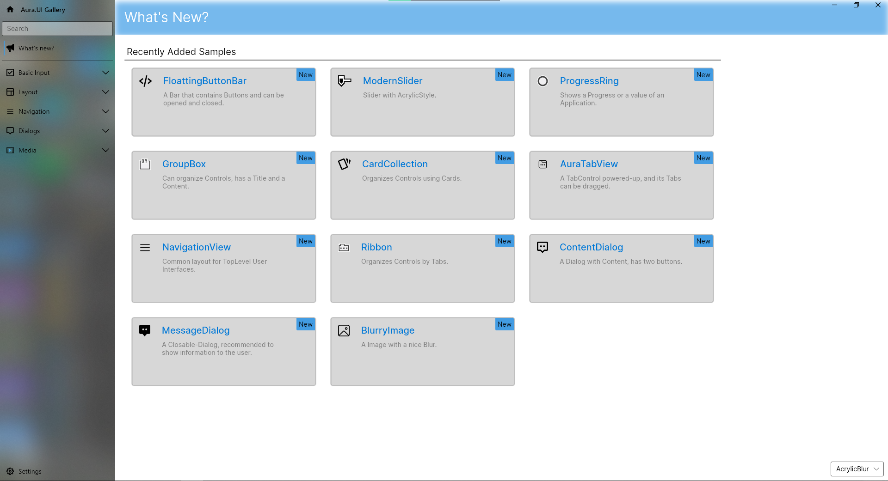
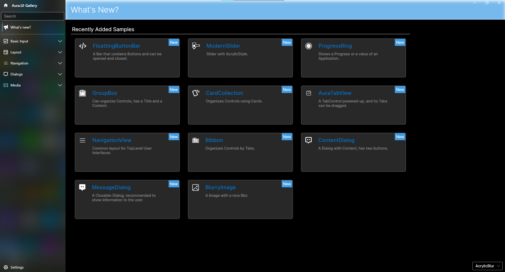

## AuraTabView
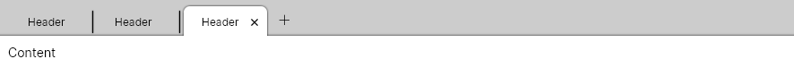
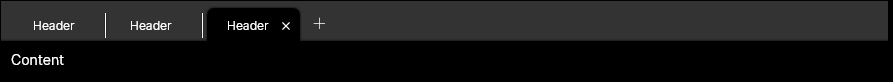

## Badge
<div>
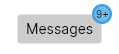
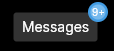
</div>

## BlurryImage
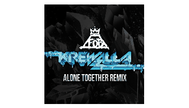

## CardCollection 
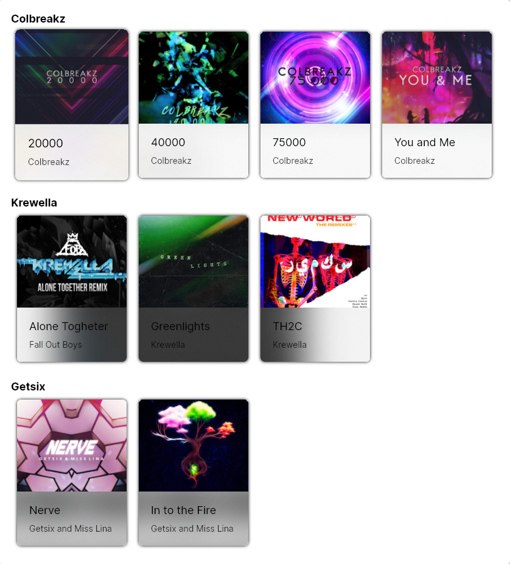
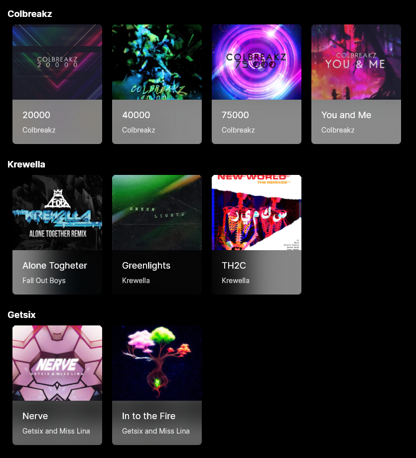

## ContentDialog
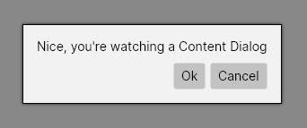
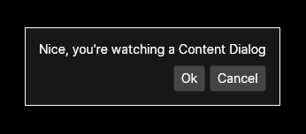

## FloatingButtonBar


## GroupBox
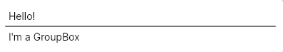
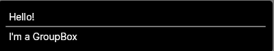

## MessageDialog
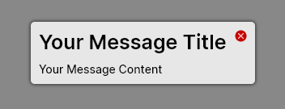
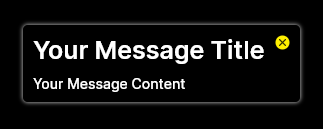

## ModernSlider 
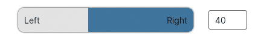
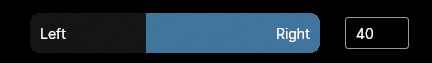

## NavigationView 
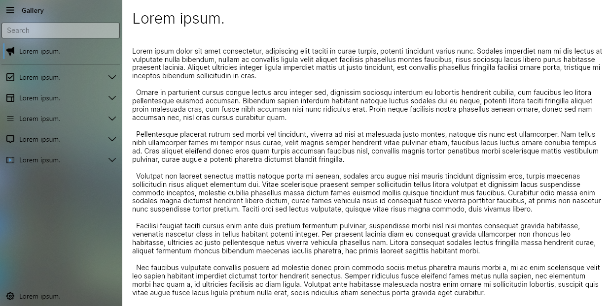
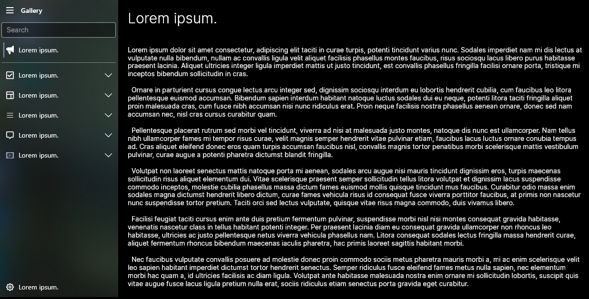

## ProgressRing
<div>
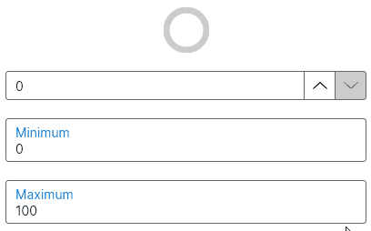
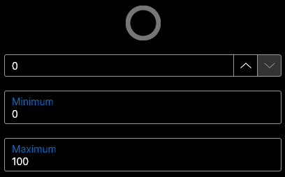
</div>
<div>


</div>

## RadialSlider
<div>
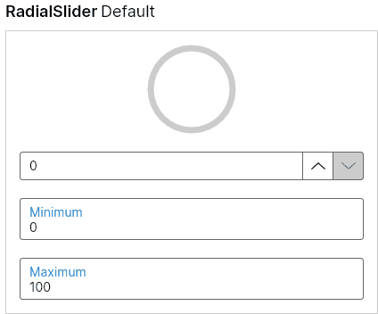
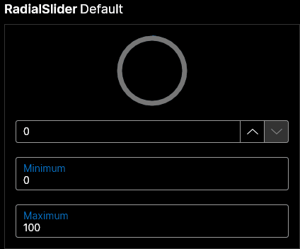
</div>

## Ribbon
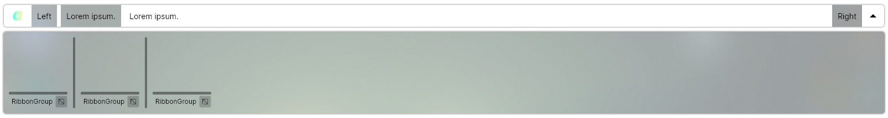
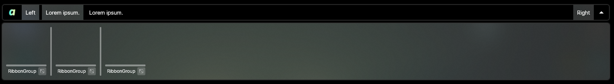

# Nightly Versions

When you want to install unstable versions, add the next link to Nuget Sources:

```
https://www.myget.org/F/auraui/api/v3/index.json
```

# Aura.UI License

Aura.UI is an Open Source controls library with MIT license, so, feel free to use it in Non-Commercial and Commercial Projects.  

## Credits 

This library is possible thanks to the follow projects:
   * [Avalonia](http://avaloniaui.net/) by the AvaloniaUI Team.

## To Do

- Documentation


# How To Collaborate

Just enter to the follow Gitter chat! 

[](https://gitter.im/AuraDevCommunity/Aura-UI) 

Or make a pull request! All pull request are welcome!

# Special thanks to

<a href="https://jb.gg/OpenSource"><a>
