[](https://gitter.im/AuraDevCommunity/Aura-UI)
[](https://www.nuget.org/packages/Aura.UI) 
[](https://www.nuget.org/packages/Aura.UI) 
[]( https://discord.gg/JY9sDq)

<h1 align="center">
 
<br/><br/>
Aura.UI
</h1>


<h2 align="center">Control's Library for Avalonia</h2>

# Overview

* Controls Availables
  *  AuraTabItem 
  *  AuraTabView
  *  SuperColorPicker
  *  ColorPickerButton
  *  PagesView
  *  GroupBox
  *  FilledSlider
  *  ModernSlider
  *  Ribbon
  *  SuperListBoxItem
  *   * NavigationView 
  
* Controls in Developing
   * GradientEditor : This control creates a GradientBrush to use in other controls.
   * Follower : This Control follow the cursor whitin a control.
   * ColourSlider : This slider has colors as values.
   * ProgressRing : This is similar to progressbar, but is indefinite.
   
* Windows Availables
   * ColorWindowSmall : This window shows a ColorPicker.

* Windows in Developing:
   * ChangeColorWindow : This window creates a SolidColorBrush or GradientBrush.

* Planned Controls and Windows for future versions:
   * TabbedWindow : An optimized window to use with AuraTabItems. 
   * StatusBar : This bar shows an status of application, it will use a class for the status.
   * WriteablePanel : A panel por represent and edit images easily. 
   
* UI Extensions
   * TabControlExtensions:
   ```c#
    CloseTab(this TabControl tabControl, TabItem tabItem) //CloseTab with itself
    CloseTab(this TabControl tabControl, int index) //CLoses Tab with index
    AddTab(this TabControl tabControl, TabItem TabItemToAdd,bool Focus)
    //Add a Tab 
   ```
   * TemplatedControlExtensions:
   ```c#
    GetControl<T>(this TemplatedControl templatedControl ,TemplateAppliedEventArgs e, string name) where T : AvaloniaObject
    //Return an AvaloniaObject from Template
   ```
   * LogicalExtensions:
   ```c#
   GetParentTOfLogical<T>(this ILogical Logical) where T : class {}
   // Return the closest logical parent

   GetParentTOfLogical<T>(this ILogical Logical) where T : class {}
   // Return the closest window parent
   ```
   * Extensions in Developing 
   ```xml
     <!--RevealExtension ==> This extension for xaml create a RevealEffect for a Brush Property-->
     <Button Background={Reveal TintColor=Gray, CursorRadius=20, Opacity=0.5}></Button>
    ```

# Install

Now the library is available in Nuget.org.

<h2>First Step</h2>

Go to the next link: https://www.nuget.org/packages/Aura.UI .

<h2>Second Step</h2>

Install Aura.UI with Visual Studio or dotnetCLI:

<h3>Visual Studio</h3>

Open the Nuget Packages Manager on your project and search 
Aura.UI.

</img>

<h3>Dotnet CLI</h3>

Open the terminal on the root folder of your project and write <br/>
```shell
dotnet add package Aura.UI --version 0.1.3-preview6
```
 Do it like this:

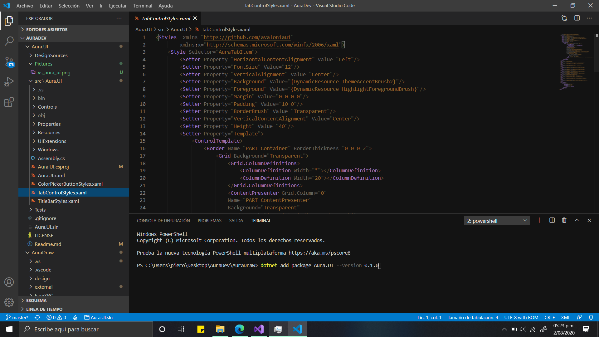</img>


# Preparation

Add Styles to App.xaml

```xml
  <Application  xmlns="https://github.com/avaloniaui"
                xmlns:x="http://schemas.microsoft.com/winfx/2006/xaml"
                x:Class="YourApp.App">
    <Application.Styles>
        <StyleInclude Source="avares://Avalonia.Themes.Default/DefaultTheme.xaml"/>
        <StyleInclude Source="avares://Avalonia.Themes.Default/Accents/BaseDark.xaml"/>
       <StyleInclude Source="avares://Aura.UI/AuraUI.xaml"/> <!-- Add this Source --> 
       <StyleInclude Source="avares://Aura.UI/AuraAcrylicBase.xaml"/> <!--When you use a controls with IMaterial Interface , you should add this source-->
    </Application.Styles> 
   </Application>
```

Next add this *using* instructions:

``` c#
using Aura.UI.Controls;
using Aura.UI.UIExtensions;
using Aura.UI.Windows;
```

# Controls

## AuraTabItem 

 A Closable TabItem what has extra features.
 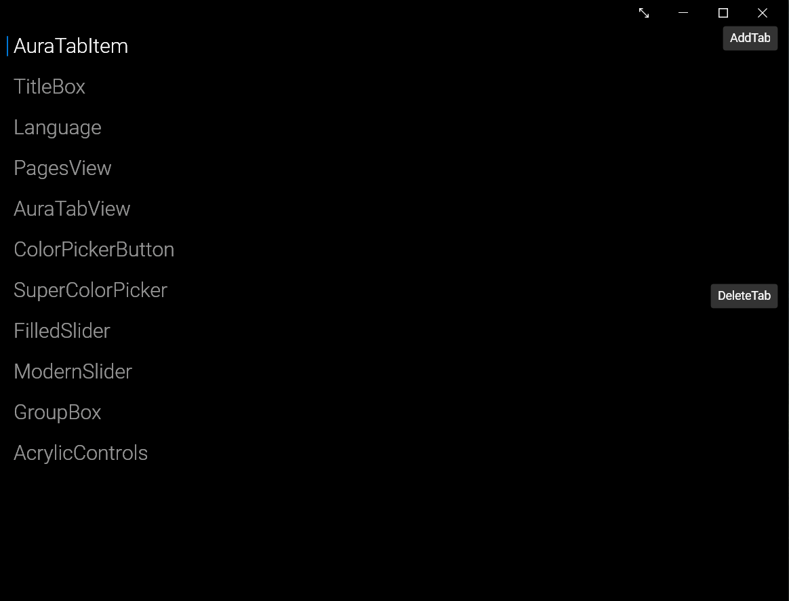

## AuraTabView

Is similar to TabControl, but this can add new tabs with a built-in button, also its tabs reduce its width when the spacing is little.

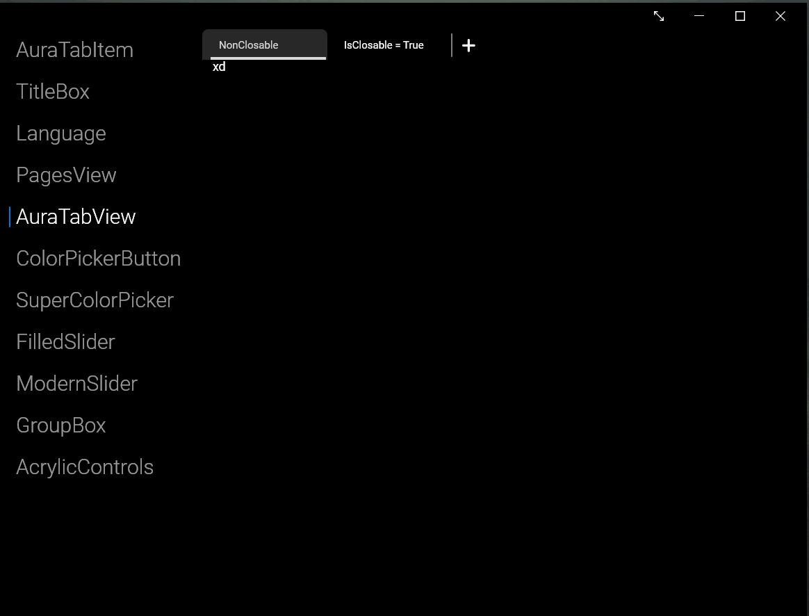

## TitleBox

Similar to GroupBox, but has 2 buttons and is easy-to-custom.
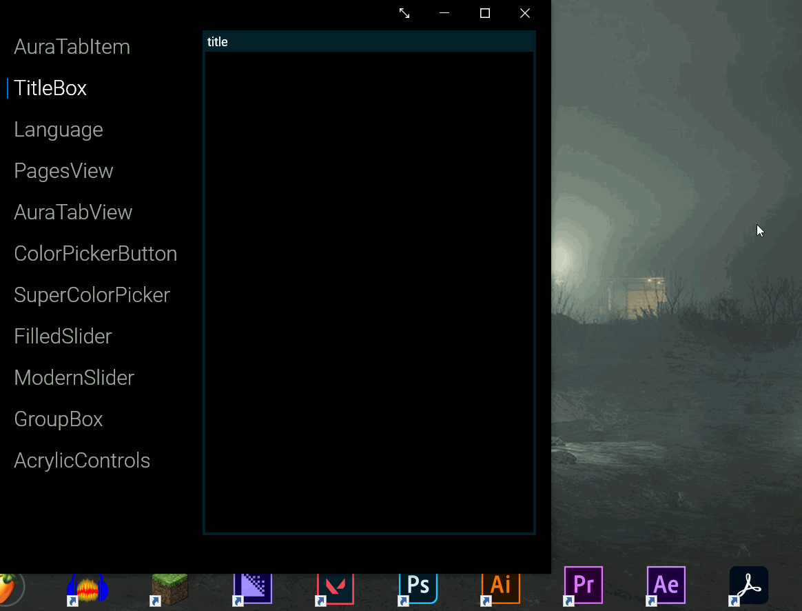

## SuperColorPicker

This color picker can modify the opacity and the color of a SolidColorBrush, and let you see a preview, too.

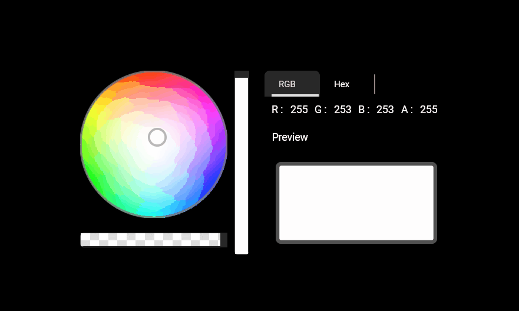
## ColorPickerButton 
A Toggle Button when you click it, shows a ColorPicker on a Window.

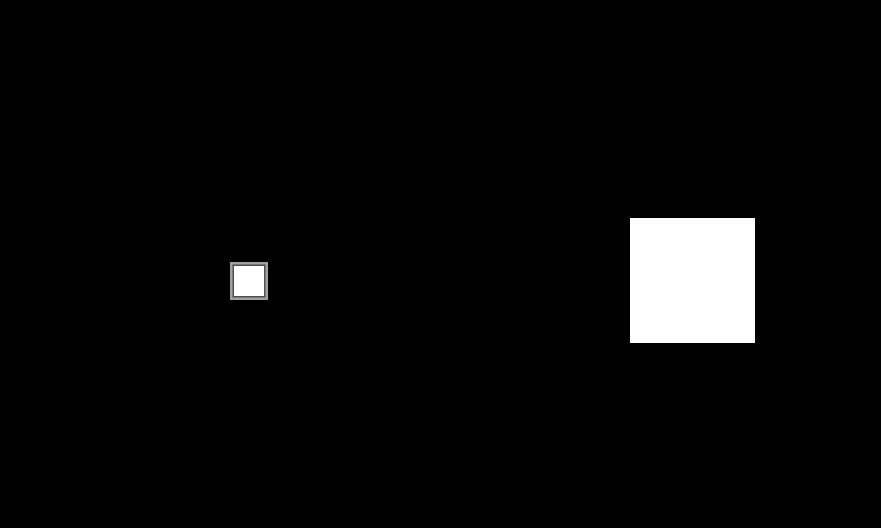

## PagesView 

 A Pages Collection for simplify the life.

 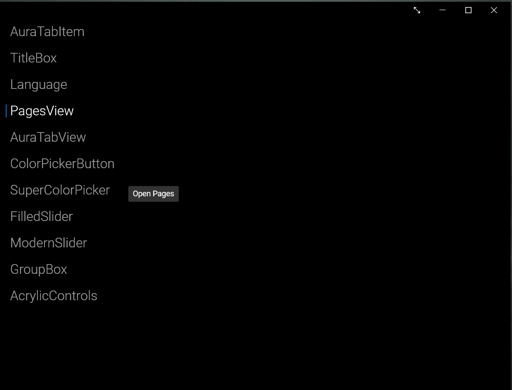

## ModernSlider

This Slider imitates the Android Slider, but uses the Acrylic Textures!

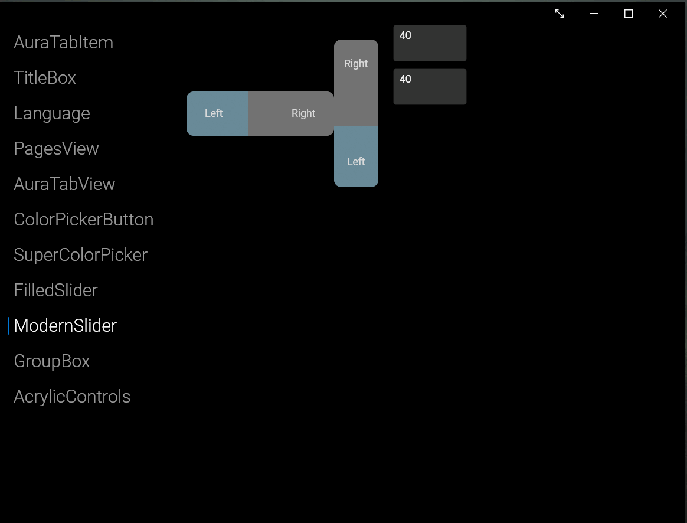

## GroupBox

This Control has a header and that show it in the top.

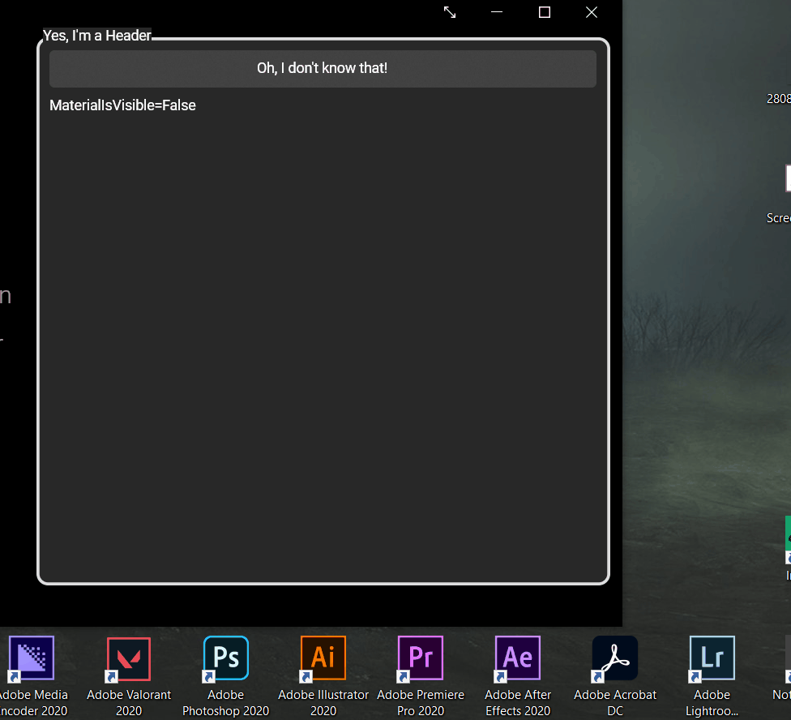

## Ribbon (Preview)

This control shows a Ribbon, and use its own subcontrols.

 

### Ribbon SubControls:

   * RibbonItem : It's the principal content selector, has a header and the content property.
   * RibbonPanel : This panel must be into the RibbonItem Content, organizes the RibbonGroups.
   * RibbonGroup : This HeaderedContentControl organizes the groups of the RibbonItem.
   * RibbonSeparator : This control separates the RibbonGroups.
  
 The default height of the container is ```150```, but if you want to change it, you have to edit the follow resource:
 ```xml 
   <ParentWindow xmlns:ms="clr-namespace:System;assembly=netstandard">
      <ParentWindow.Resources>
         <ms:Double x:Key="DefaultRibbonContainerHeight">200</ms:Double>
      </ParentWindow.Resources>
   </ParentWindow>
 ``` 
### Example:

```xml
   <Border Padding="10">
      <Border.Resources>
			<ms:Double x:Key="DefaultRibbonContainerHeight">170</ms:Double>
      </Border.Resources>
		<Ribbon Header="HeaderTest" LeftContent="File" RightContent="Settings" ExpansionState="Total">
			<RibbonItem Header="Start">
			   <RibbonPanel>
					<RibbonGroup Header="Colour">
						<Border Background="Yellow" Height="90" Width="100"/>
					</RibbonGroup>
					<RibbonSeparator/>
					<RibbonGroup Header="Themes">
						<StackPanel Orientation="Horizontal">
							<Border Background="Black" Width="60" Height="90"/>
							<Border Background="White" Width="60" Height="90"/>
						</StackPanel>
					</RibbonGroup>
				   <RibbonSeparator/>
					<RibbonGroup Header="Fonts">
						<StackPanel Spacing="10">
							<TextBlock FontSize="20">Ribbon</TextBlock>
							<TextBlock FontSize="14">Ribbon</TextBlock>
							<TextBlock FontSize="10">Ribbon</TextBlock>
						</StackPanel>
					</RibbonGroup>
				</RibbonPanel>
			</RibbonItem>
			<RibbonItem Header="Edit">
				<RibbonPanel>
				</RibbonPanel>
			</RibbonItem>
		</Ribbon>
	</Border>
```

This xaml code produces this result:

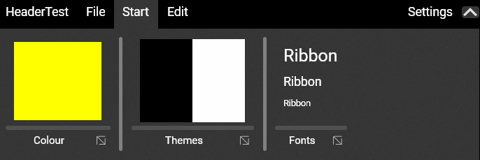

## SuperListBoxItem

This ListBoxItem has a Icon and styled texts.

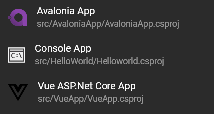

## NavigationView

This Control is really recommended for the main navigation of an application.

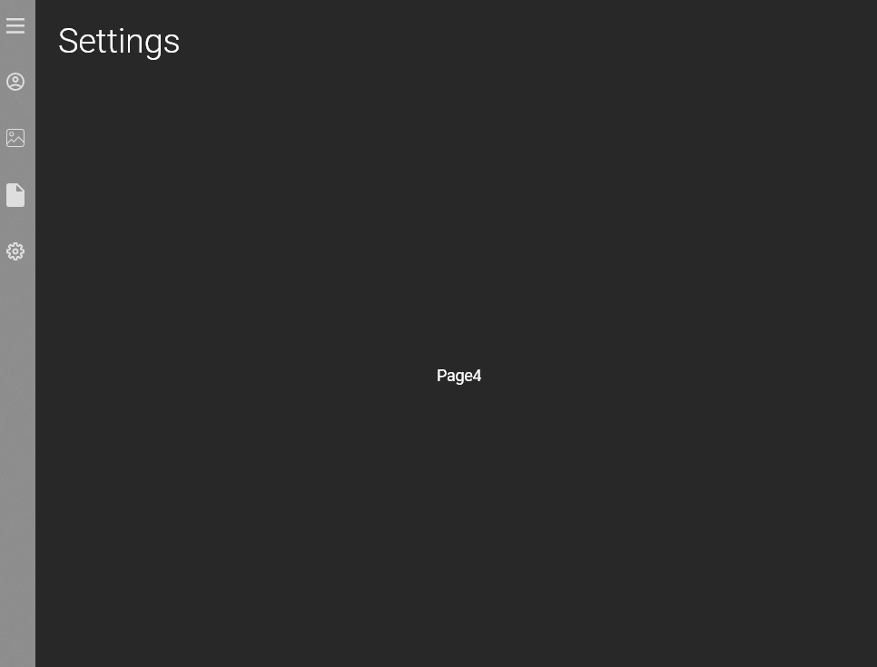

*Default style of NavigationView*

### NavigationView Subcontrols:

   * NavigationViewItem: This represent an item of the NavigationView, to ubicate that in the bottom you shouls add the class ".Footer"
   Like this:
   ```xml
   <NavigationView Classes="Footer"/>
   ```
   For now you should order it backwards.
   ```xml
   <NavigationViewItem Classes="Footer" Header="1"/>
	<NavigationViewItem Classes="Footer" Header="2"/>
	<NavigationViewItem Classes="Footer" Header="3"/>
	<NavigationViewItem Classes="Footer" Header="4"/>
	<NavigationViewItem Classes="Footer" Header="5"/>
   ```

   This code produce this:

   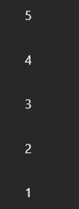

### Custom NavigationView

The follow code make an custom NavigationView
```xml
<Border>
	<Grid>
		<Grid Background="{DynamicResource ThemeBackgroundBrush}"
				  Opacity="0.5"/>
			<NavigationView AlwaysOpen="True" HeaderIcon="{DynamicResource Material.HomeOutline}"
						Header="Home" OpenPaneLength="250" Material="{DynamicResource NullBrush}">
			<NavigationViewItem Icon="{DynamicResource MaterialLight.Picture}"
									Header="Images" Title="Images in C:/">
				<TextBlock Text="Page1"/>
			</NavigationViewItem>
			<NavigationViewItem Icon="{DynamicResource Ionicons.DocumentMD}"
									Header="Documents" Title="Documents in D:/">
			   <TextBlock Text="Page2"/>
			</NavigationViewItem>


			<!--Footer-->

			<NavigationViewItem Icon="{DynamicResource EvaIcons.Settings2Outline}"
									Header="Settings" Title="Settings"
									Classes="Footer">
				<StackPanel Spacing="20">
					<TextBlock Text="AlwaysOpen=&quot;True&quot;"/>
					<TextBlock Text="Header=&quot;Home&quot;"/>
				</StackPanel>
			</NavigationViewItem>
			<NavigationViewItem Icon="{DynamicResource EvaIcons.PrinterOutline}"
									Header="Print" Title="Printers"
									Classes="Footer">
				<TextBlock Text="Page4"/>
			</NavigationViewItem>
			<NavigationViewItem Icon="{DynamicResource Material.AccountCircleOutline}"
						Header="Accounts" Title="Accounts"
						Classes="Footer">
				<TextBlock Text="Page5"/>
			</NavigationViewItem>
		</NavigationView>
		<Border Background="{DynamicResource ThemeBackgroundBrush}"
					Opacity="0" Height="20" VerticalAlignment="Top"
					Name="drag_border"/>
	</Grid>
</Border>
```

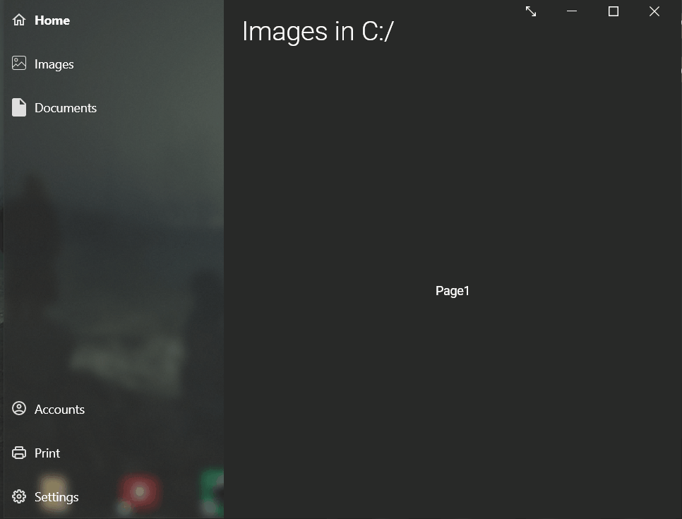

# About Aura.UI

This library is open source and free, in a few months come out the first stable version,for now, Aura.UI is a beta. 

## Credits 

This library is possible thanks to the follow projects:
   * [Avalonia](http://avaloniaui.net/) by the AvaloniaUI Team.
   * [ColorPicker](github.com/MikeCodesDotNET/ColorPicker) by MikeCodesDotNet.
   * [Math.NET Numerics](https://github.com/mathnet/mathnet-numerics) by Math.NET Team.


# How To Collaborate

If you want to collaborate with this proyect, contact me with the next links:
* [](https://wa.me/51902446088)
* [](https://www.messenger.com/t/piero.idk.2000)
* [](https://gitter.im/PieroCastillo)
